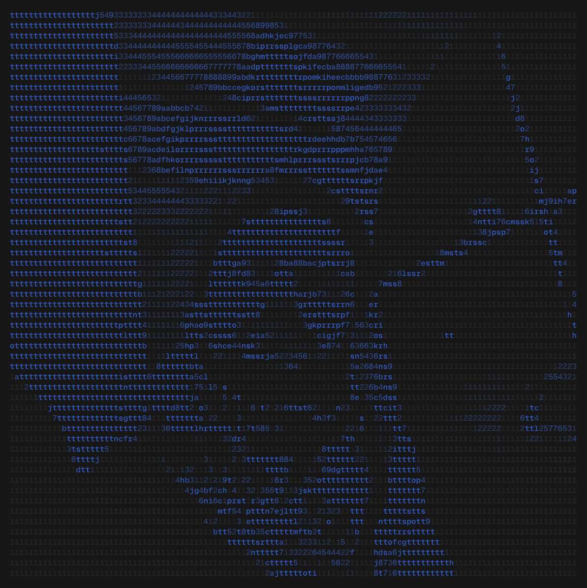

<table>
  <tr>
    <td>
      
    </td>
    <td>
      <div align="center">
        <h1>MIYAMOTO</h1>
        <sub>FULL-STACK DEVELOPER &nbsp;·&nbsp; BACKEND ENGINEER &nbsp;·&nbsp; DEVOPS</sub>
        <br />
        <br />
        <a href="https://www.linkedin.com/in/ayman-msaoub/">
          
        </a>
        <a href="https://portfoliov-2-0-1jhy.vercel.app/">
          
        </a>
        <br />
        <br />
        
      </div>
    </td>
  </tr>
</table>

<br />

---

<br />

## About

I'm a full-stack developer and student who works across the entire stack — from
interface down to the infrastructure it runs on.

My core focus is **backend engineering**: API design, databases, authentication,
real-time systems, and application architecture. Alongside that, I'm building
toward **DevOps and cloud engineering** — containerization, Kubernetes, CI/CD,
infrastructure automation, and GitOps.

```
Frontend  ──▶  Backend  ──▶  Infrastructure  ──▶  Cloud
   │              │                │                │
 React          APIs           Docker / K8s      Automation
 Next.js        Databases      CI / CD           IaC
```

<br />

---

<br />

## Stack

<table width="100%">
<tr>
<td valign="top" width="25%">

**Frontend**
<br /><br />
React&nbsp;·&nbsp;Next.js
TypeScript&nbsp;·&nbsp;JavaScript
Tailwind&nbsp;·&nbsp;Vite

</td>
<td valign="top" width="25%">

**Backend**
<br /><br />
Node.js&nbsp;·&nbsp;Express
Python&nbsp;·&nbsp;Django

</td>
<td valign="top" width="25%">

**Data & Infra**
<br /><br />
PostgreSQL&nbsp;·&nbsp;MongoDB
Redis&nbsp;·&nbsp;Docker
Kubernetes&nbsp;·&nbsp;Nginx

</td>
<td valign="top" width="25%">

**DevOps & Cloud**
<br /><br />
Linux&nbsp;·&nbsp;Git
Terraform&nbsp;·&nbsp;Ansible
AWS

</td>
</tr>
</table>

<br />

---

<br />

## Featured Projects

<table width="100%">
<tr>
<td width="50%" valign="top">

### ft_transcendence

Real-time multiplayer web application, built at 42.

- Real-time Pong over WebSockets
- Live chat system
- Authentication with 2FA
- REST API, dockerized architecture

`Django` `DRF` `React` `PostgreSQL` `Docker`

</td>
<td width="50%" valign="top">

### Inception of Things

DevOps-focused exploration of Kubernetes infrastructure.

- K3s / K3d clusters
- Helm charts, Traefik ingress
- Argo CD, GitOps workflows
- GitLab CI/CD, Vagrant provisioning

`Kubernetes` `K3s` `Docker` `Helm` `Argo CD`

</td>
</tr>
<tr>
<td width="50%" valign="top">

### Inception

Containerized infrastructure and system administration project.

- Multi-container architecture
- Docker Compose orchestration
- Nginx, MariaDB, WordPress
- Linux administration & networking

`Docker` `Nginx` `MariaDB` `Linux`

</td>
<td width="50%" valign="top">

### HyperTube

Distributed web application built around multiple backend services.

- Microservice architecture
- REST APIs across services
- Authentication & database integration
- Fully containerized services

`NestJS` `Django` `React` `PostgreSQL` `Docker`

</td>
</tr>
</table>

<br />

---

<br />

## DevOps Journey

Long-term direction: deeper into DevOps, cloud, and platform engineering.

<table width="100%">
<tr>
<td valign="top" width="50%">

Currently exploring

- Docker & containerization
- Kubernetes / K3s / K3d
- Helm
- CI/CD pipelines

</td>
<td valign="top" width="50%">

&nbsp;

- Argo CD & GitOps
- Terraform
- Ansible
- AWS, Nginx, observability

</td>
</tr>
</table>

<br />

---

<br />

## Engineering Interests

API architecture&nbsp;·&nbsp;Authentication & authorization&nbsp;·&nbsp;Real-time systems
Distributed applications&nbsp;·&nbsp;Database design&nbsp;·&nbsp;Caching
Containerization&nbsp;·&nbsp;Kubernetes&nbsp;·&nbsp;CI/CD&nbsp;·&nbsp;Infrastructure as Code
Cloud architecture&nbsp;·&nbsp;System reliability&nbsp;·&nbsp;Automation

<br />

---

<br />

<div align="center">

## Contribution Activity


</div>

<br />

---

<br />

<div align="center">

## Let's Connect

Open to projects, internships, and collaborations around backend development,
full-stack engineering, DevOps, and cloud infrastructure.

<br />

<a href="https://www.linkedin.com/in/ayman-msaoub/">
  
</a>
<a href="https://portfoliov-2-0-1jhy.vercel.app/">
  
</a>

<br />
<br />

<sub>BUILD &nbsp;→&nbsp; BREAK &nbsp;→&nbsp; UNDERSTAND &nbsp;→&nbsp; AUTOMATE</sub>


</div>
